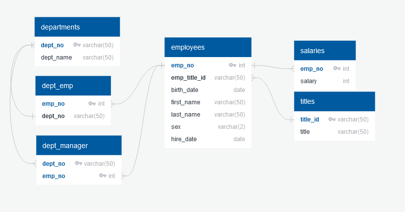

# sql_challenge README

### Data Modeling

Using the 6 CSV files I was provided (departments.csv, dept_emp.csv, dept_manager.csv, employees.csv, salaries.csv, and titles.csv), I sketched an Entity Relationship Diagram (ERD) of the tables using [QuickDBD](http://www.quickdatabasediagrams.com).

### Data Engineering

I created a table schema (EmployeeSQLTableSchemata.sql) for the CSV files ensuring to specify the data types, primary keys (dept_emp and dept_manager required composite keys), foreign keys, and other constraints. I created the tables in the correct order to handle the foreign keys and then imported each CSV to the corresponding SQL table. 

One issue I ran into was dept_emp and dept_manager was getting a foreign key constraint error when linking to departments. I inspected the CSVs and didn't see an issue. I then select * from departments and saw there were double quotes around each dept_no and dept_name. I removed the foreign key constraint for dept_emp and dept_manager and select * from them and saw they did not have any quotes. So I updated departments to replace '"' with ' '. This corrected the issue. Upon further inspection of the CSV encoding I found that by saving departments.csv as UTF-8 csv this could also solve the issue. This is commented in the TableSchema as well. 

### Data Analysis

I then performed the following queries (EmployeeSQLQueries.sql) on the database:

1. List the employee number, last name, first name, sex, and salary of each employee.
2. List the first name, last name, and hire date for the employees who were hired in 1986.
3. List the manager of each department along with their department
   number, department name, employee number, last name, and first name.
4. List the department number for each employee along with that
   employee’s employee number, last name, first name, and department name.
5. List first name, last name, and sex of each employee whose first name is Hercules and whose last name begins with the letter B.
6. List each employee in the Sales department, including their employee number, last name, and first name.
7. List each employee in the Sales and Development departments,
   including their employee number, last name, first name, and department
   name.
8. List the frequency counts, in descending order, of all the employee
   last names (that is, how many employees share each last name).
